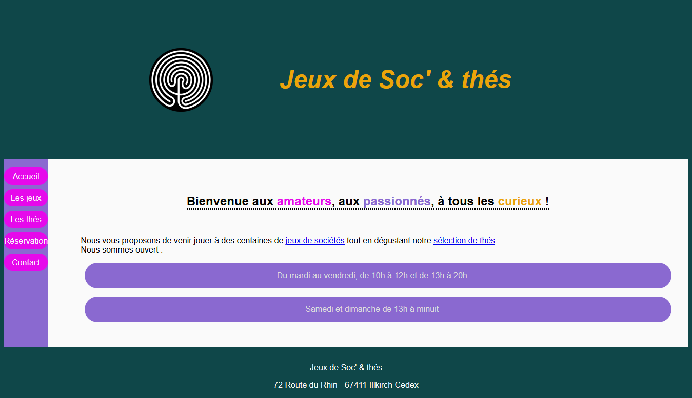
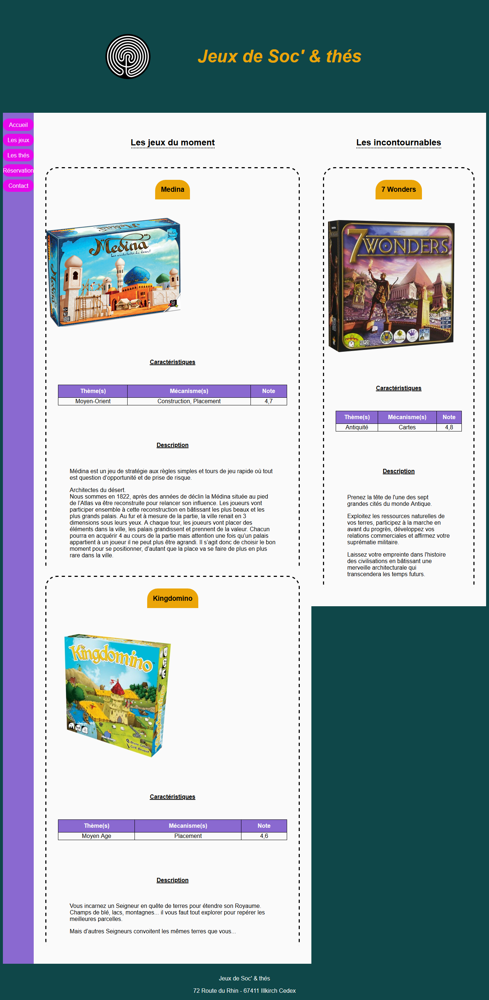
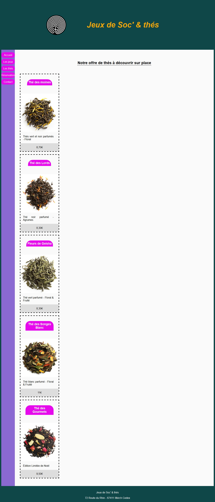
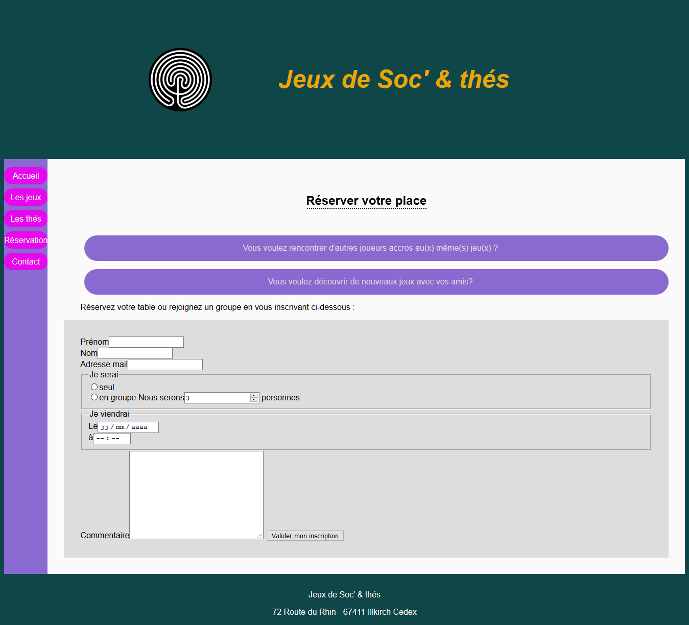
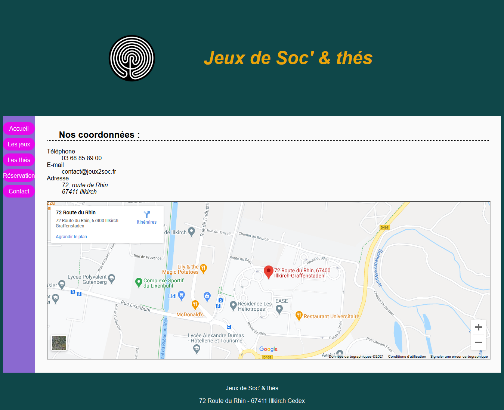

# Web Site

 

 

 

 

 
# Description 

Devellopement d'un web site qui simule la vente de thé 

# IT language
- HTML
- JAVA Script 
- CSS

# How to test the code 

Download the files and place them in the same folder and then open the index.hml file with a browser. 
