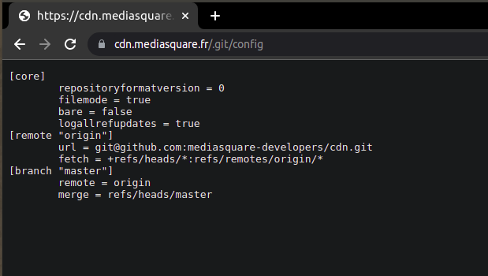
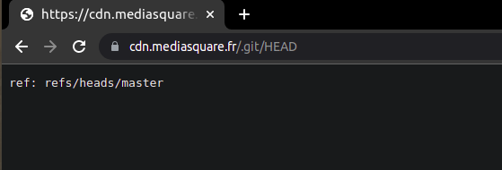
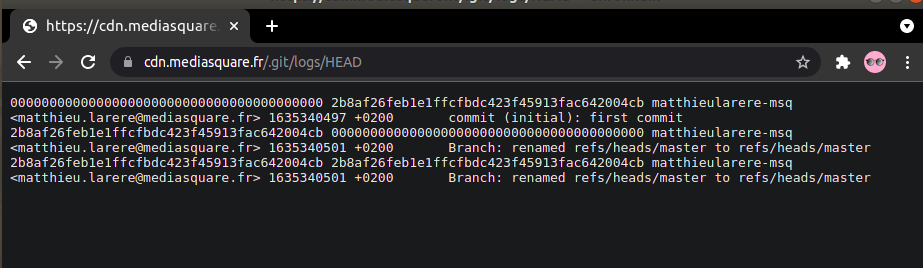
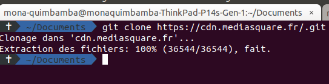
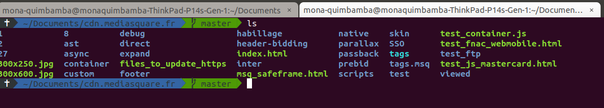

# Git

### 1. Définition

Git est un système de contrôle de versions d'un projet, permmettant de conserver l'historique complet des versions du logiciel.  Dans Git, chaque copie de travail du code est également un dépôt qui contient l'historique complet de tous les changements.

### 2. Comment utiliser Git

#### * Configuration de votre profil dans votre machine en local

On peut définir les valeurs de configuration globales
de façon suivante :

 * Avec les commandes suivantes

  ```git config --global user.name <pseudo>```

  ```git config --global user.email <toto@domain.fr>```
  
 ces commandes vont créer un fichier de configuration dans
   ```~/.gitconfig```


#### * Avoir un dépôt Git en local

 Il existe deux façons de faire un dépôt git en local:
 
  ***on peut cloner un dépôt en ligne existant*** ou ***initialiser un nouveau dépôt***.

 * Initialiser un nouveau dépôt

 ``` git init ```

 cette commande permet de créer un dépôt git en local. Pour connecter le dépôt en local à un dépôt en ligne il faut faire la commande suivante.
 
 ##### remote

Cette commande permet de connecter un dépôt git local avec un dépôt git en ligne.

``` git remote add <url> ```


 * Cloner un dépôt en ligne existant

 Cloner un dépôt git, permet faire une copie complète d'un dépôt en ligne
pour faire cela il faut  avoir ***l'url*** du dépôt git en ligne et faire la commande suivante.

``` git clone <url> ```

Cette commande va créer un dépôt en local qui a le  même nom que l'original, mais on peut changer le nom en ajoutant un nom après ****l'url****.


``` git clone <url> <nom_dossier> ```

#### * Ignorant certains fichiers

On peut demander au git de n'est pas ajouter un fichier critiqué dans le depôt à distance pour faire cela , il faut créer un fichier nommée ***.gitignore*** et dedans on ajoute le nom des fichiers ou dossiers que l'on ne veut pas l'ajouter à distance.

#### * Ajouter un fichier.

pour ajouter un fichier on utilise la commande :

```git add <nom_fichier>```

ou

```git add .```
Pour ajouter l'ensemble des fichiers d'un dossier


#### * La commande Commit

La commande add est souvent suivie par la commande ***commit***, qui transforme le fichier
dans un objet prêt à être envoyer à distance.

Le commit courant est appelle **HEAD**

La commande commit se fait comme ceci :


``` git commit -m "<msg>" ```


#### * La commande Status

On peut vérifier l'état du dépôt en local avec la commande ***status***

```git status ```


#### * Supprimer un fichier

On peut supprimer un fichier avec la commande ***rm*** , cela supprime le fichier du dépôt en local et en ligne

```git rm <nom_fichier> ```


#### * La commande Diff

Cette commande fait une comparaison des changements des sources qui peuvent être ( des commits, des fichiers, des branches , etc).

``` git diff  <arg1> <arg2>```

### 3. Branch

Une branche dans git représente un répertoire à distance où le projet sera stocké, la branche par défault est ***master*** .

La commande suivante permet de créer une nouvelle branche

``` git branch <nom_branche> ```

La nouvelle branche aura l'ensemble des fichiers de sa branche mère.

#### * La commande Checkout

Cette commande permet de changer de branche:


``` git checkout <nom_branche> ```

On peut également créer une nouvelle branche avec l'option -b :


``` git checkout -b  <nom_branche> ```

#### * Fusionner deux branches


Pour fusionner deux branches on se place dans la branche réceptrice et puis on fait la commande suivante.


``` git merge  <nom_branch_sourcee> ```

#### * Envoyer les fichiers du dépôt local vers le dépôt en ligne

Pour envoyer les fichiers à une branche on fait la commande suivante.


``` git push origin <nom_branch>```


#### * Récupérer les fichiers de la branche à distance  vers le dépôt en local

Pour récupérer les fichiers d'une branche on fait la commande suivante.


``` git pull origin <nom_branch>```

#### * La commande Reset


Cette commande permet d'annuler un commit.

Un exemple de l'annulation du derniere commit

``` git reset --hard HEAD```

#### * La commande stash

Cette commande permet de sauvegarder les fichiers qui étaient en cours des modifications sans avoir à faire un commit de ces fichiers.


``` git stash ```


### Git workflow


# Les différentes façons d'utiliser git dans un projet.

* Avec la console
* Avec un IDEA qui implémente git
* Avec un logiciel de gestion du git comme  , gitlab, github ou gitkraten par exemple

# Vulnérabilité d'un projet qui peut être exploité à partir du dossier .git 

Certains développeurs oublient et publient le dossier .git après avoir déployé le rendu d'un projet, à partir de ce dossier, des personnes malveillantes peuvent  analyser le contenu du dépôt git  et puis d'essayer de détecter d'autres vulnérabilités à l'aide d'une analyse de code statique.

Si vous êtes intéressé, voici une liste de sites existants qui ont leur .gits en public.


 - https://cdn.mediasquare.fr
 - https://www-static.ubuntu-fr.org
 - https://www.quiz.aep.polymtl.ca
 - https://static.openedition.org
 - https://www.calendrier.best

### Exemple d'analyse de cette vulnérabilité

Pour trouver cette vulnérabilité on peut utiliser l'extension **dotGit** à ajouter  dans le navigateur web ou l'outil GitTools qui est disponible sur github **https://github.com/internetwache/GitTools**

on prend le site *** https://mediasquare.fr***

#### étape - 1  :

Confirmer que le contenu du dossier .git est accessible , pour cela on peut essayer d'accéder au fichier de configuration du projet.

* https://cdn.mediasquare.fr/.git/config




on peut également regarder  la dernière commit avec cette commande

* https://cdn.mediasquare.fr/.git/HEAD



On peut visualiser la liste de logs

* https://cdn.mediasquare.fr/.git/logs/HEAD





#### étape - 2 :

Maintenant qu'on est sûr que le dossier .git est disponible au public on peut faire un clone et récupérer le code source 

* clonage du dépôt



Maintenant, on peut analyser le contenu du dépôt git et également chercher des vulnérabilités dans le code et ensuite  reporter aux propriétés de ce site web pour avoir un Bounty.




# Références


* https://raw.githubusercontent.com/pluralsight/git-internals-pdf/master/drafts/peepcode-git.pdf
