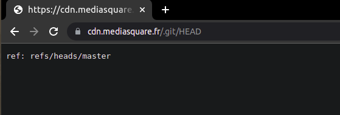
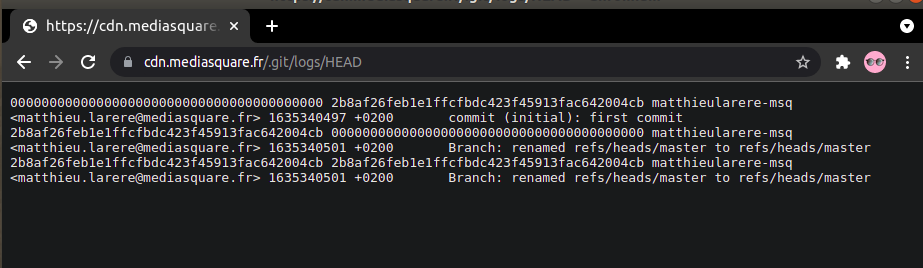
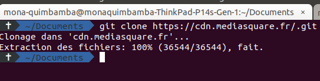

### git définition

Git est un système de contrôle de version d'un projet

### Comment utiliser Gi

 Quelques-unes des les commandes de base pour utiliser Git efficacement.

#### Configuration de votre profil

On peut definir les valeurs de configuration globales
de façon suivante :

 * Avec les commandes suivantes

  ```git config --global user.name "Bastien"```

  ```git config --global user.email "Bastien@bastien.fr"```

  cette methode va créer un fichier de configuration dans

   ```~/.gitconfig```


#### Avoir un Repertoire Git en local

 Il existe deux façon pour faire un repertoire git en local,
 on peut cloner un repertoire existant ou initialiser un nouveau repertoire.

 * Initialiser un repertoire

 ``` git init ```

 cette commande va creer un dosier .git

 * Cloner un repertoire existant

 Cloner un repertoire git est faire une copie complete d'un autre repertoire
pour faire cella il faut  avoir ***l'url*** du repertoire git et faire la commande suivante.

``` git clone <url> ```

Cette commande va creer un repertoire en local qui a le  même nome que l'original , mais on peut changer le nom en ajoutant un nom après ****l'url****.


``` git clone <url> <nom_dossier> ```

#### Ignorant certains fichiers

On peut demander au git de n'est pas ajouter un fichier critiqué dans le depôt à distance pour faire cela , il faut creer un fichier nommée ***.gitignore*** et dedans on ajoute le nomes des fichiers ou dossiers qu'on ne veut pas l'ajouter à distance.

#### Ajouter un fichier dans le repertoire local .

pour ajouter un fichier on utilise la commande :

```git add <nom_fichier>```
or

```git add .```
Pour ajouter l'ensemble des fichiers d'un dossier


#### Commit

la commande add est souvent succede par la commande ***commit***, qui transforme le fichier
dans un objet prêt à être envoyer à distance.

Le commit courrant est appelle **HEAD**

La commmande commit est faite de cette façon :


``` git commit -m "<msg>" ```


#### Status

On peut verifier l'état du repertoire avec la commande ***status***

```git status ```

Cette commande affiche l'état des fichiers du repertoire en local

#### Supprimer un fichier

On peut supprimer un fichier avec la commande ***rm***

```git rm <nom_fichier> ```


#### Diff

Cette commande permet de comparer les fichiers qui sont en local et celles qui sont déjà un mode objets et à jour.

``` git diff ```

#### Branch

Une branche dans git represente un repertoire à distance où le projet sera stocké, la branche par default est ***master*** .

``` git branch <nom_branche> ```

la nouvelle branche aura l'ensemble des fichiers apartir du derniere commit.

#### Checkout

Cette commande permet de changer de branche avec la commande :


``` git checkout <nom_branche> ```

On peut également créer une nouvelle branche avec la commande :


``` git checkout -b  <nom_branche> ```

pour creer une branche on fait.

``` git branch <nom_branch>```


#### fusionner deux branche


pour fussionner deux branche on se place dans la branche qui doit recevoir le contenu et puis on fait la commande suivante.


``` git merge  <nom_branch_sourcee> ```

#### Envoyer les fichiers du repertoire local vers les repertoire à distance (une branche especifique)

Pour envoyer les fichiers à une branche on fait la commande suivante.


``` git push origin <nom_branch>```

#### Récuperer les fichiers de la branche à distance  vers le repertoire en local

Pour récuperer les fichiers à une branche on fait la commande suivante.


``` git pull origin <nom_branch>```

#### Reset


Cette commande permet d'annuler un commit.

Un exemple de l'annulation du derniere commit

``` git reset --hard HEAD```

#### stash

Cette commande permet de changer de branche et sauvegarder les fichiers qui étaient en cours de modifications sans avoir à faire un commit de ces fichiers.


``` git stash ```


#### remote

Cette commande permet de connecter un repertoire git local avec un repertoire git distanciel

``` git remote add <url> ```

### Git workflow


Les objets du git :

- commit :

  L'auteur du commit , le message

- Tree :

  poitnteur vers un fichiers ou vers une autre Tree
- Blob:

  code source , images, videos , fichier ...


tag et les branche pointent dans le un commint


 Head , est un especial pointeur sur le derniere commit

# les differentes façon d'utiliser git dans un projet.

* Avec la console
* Avec un IDEA qui implemente git
* Avec un logicel de gestion du git comme  gitkraten par exemple

# Attaques utilisant .git

Certains developeurs oublient et publient le dossier .git après avoir deployer le rendu d'un projet, apartir de ce dossier  vous pouvez analyser le depot git en local manuellement et puis d'essayer de détecter d'autres vulnérabilités à l'aide d'une analyse de code statique.

Voici une liste des site existant qui ont leurs .git en plublic.


 - https://cdn.mediasquare.fr
 - https://www-static.ubuntu-fr.org
 - https://www.quiz.aep.polymtl.ca
 - https://static.openedition.org
 - https://www.calendrier.best

# Exemple d'analyse de cette vulnérabilité

Pour trouver cette vulnérabilité on peut utiliser l'extension **gotGit** à ajouter  dans le navigateur ou l'outil GitTools qui est disponible sur github **https://github.com/internetwache/GitTools**

on prend le site *** https://mediasquare.fr***

#### étape - 1  :

Confirmer que le contenu du dossier .git est accessible , pour cela on utilise les commandes les plus communs.

* https://cdn.mediasquare.fr/.git/config


on visualiser la liste des branches du depot git, avec cette commande.

* https://cdn.mediasquare.fr/.git/HEAD



on visualise le derniere commit avec cette commande


* https://cdn.mediasquare.fr/.git/logs/HEAD

On visualise la liste de logs



#### étape - 2 :
Pour pouvoir acceder au code on doit récuperer le code en local , pour cela on suit les pas suivants:

* clonage du dépôt



Maintenat , on peut verifier le contenu du depot git et également cherher des vulnerabiltés dans le code et en suite bambam le site web


# Références


* https://raw.githubusercontent.com/pluralsight/git-internals-pdf/master/drafts/peepcode-git.pdf
